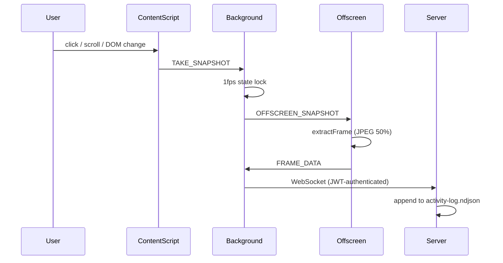

# Visual AI Agent

**Author:** Devananditha V  
**Repository:** [Visual-AI-Agent---a-Chrome-Extension](https://github.com/Devananditha/Visual-AI-Agent---a-Chrome-Extension)


---

## Overview

Visual AI Agent is a Chrome Extension (Manifest V3) paired with a Node.js/Express backend that monitors browser activity, captures visual snapshots on user interaction, and streams them to a local datastore for review.

The system is designed as a foundation for visual AI pipelines: it observes real user behavior in the browser, extracts compressed frame data on meaningful events (clicks, scrolls, DOM mutations), transmits payloads over a secured WebSocket, persists them in an append-only NDJSON log, and renders captured sessions through a local Activity Playback Dashboard.

**Core capabilities:**

- Event-driven screen capture triggered by user activity (not blind interval polling)
- MV3-compliant architecture using an offscreen document and service worker coordination
- JWT-secured WebSocket ingestion pipeline
- Auto-reconnecting stream with exponential backoff and jitter
- Local NDJSON storage with automated 30-day retention

---

## Quick Start

### Prerequisites

- [Node.js](https://nodejs.org/) v18 or later
- Google Chrome (Manifest V3 support)

### 1. Clone the repository

```bash
git clone https://github.com/Devananditha/Visual-AI-Agent---a-Chrome-Extension.git
cd Visual-AI-Agent---a-Chrome-Extension
```

### 2. Install and start the backend

```bash
cd server
npm install
npm start
```

Expected output:

```
[Server] HTTP server listening on http://localhost:3000
[Server] WebSocket endpoint available at ws://localhost:3000/vision-stream
[Server] Activity log path: .../server/data/activity-log.ndjson
```

The server exposes:

| Endpoint | Description |
|---|---|
| `POST /api/auth` | Issues a JWT for WebSocket authentication |
| `ws://localhost:3000/vision-stream?token=<JWT>` | Ingests frame payloads |
| `GET /api/activity` | Returns parsed NDJSON records |
| `GET /viewer.html` | Activity Playback Dashboard |

### 3. Load the Chrome Extension

1. Open Chrome and navigate to `chrome://extensions`
2. Enable **Developer mode** (top-right toggle)
3. Click **Load unpacked**
4. Select the repository root directory (the folder containing `manifest.json`)
5. Pin the **Visual AI Agent** extension to the toolbar

### 4. Start tracking

1. Ensure the backend server is running **before** starting the extension
2. Open any web page you wish to monitor
3. Click the extension icon and press **Start Tracking**
4. Interact with the page (click, scroll, navigate) to trigger captures
5. Press **Stop Tracking** when finished

---

## Verification

### End-to-end pipeline test

1. Start the server (`npm start` in `server/`)
2. Load the extension and click **Start Tracking** on an active tab
3. Browse normally for 30–60 seconds (click links, scroll, trigger UI changes)
4. Confirm the server terminal logs frame saves:

   ```
   [Server] Token requested
   [Server] WebSocket client connected on /vision-stream?token=***
   [Server] Saved frame at 2026-... (length: ...)
   ```

5. Open the Activity Playback Dashboard:

   ```
   http://localhost:3000/viewer.html
   ```

6. Verify captured screenshots render in a responsive grid with readable timestamps (newest first)

### Service worker diagnostics

On `chrome://extensions`, click **Inspect views: service worker** for the extension. Expected logs during normal operation:

```
[Background] Tab capture stream started in offscreen document.
[Background] JWT fetched successfully.
[Background] WebSocket connected.
[Background] Heartbeat received from offscreen document at ...
```

---

## Project Structure

```
Visual-AI-Agent/
├── manifest.json          # MV3 extension manifest
├── background.js          # Service worker: auth, WebSocket, throttling
├── content.js             # DOM event listeners and snapshot triggers
├── offscreen.html/js      # Hidden video capture and frame extraction
├── popup.html/js          # Start / Stop tracking UI
└── server/
    ├── server.js          # Express + WebSocket + TTL purge
    ├── public/viewer.html # Activity Playback Dashboard
    └── data/
        └── activity-log.ndjson
```

---

## Architecture



---

## Architecture and Engineering Decisions

### Manifest V3 Constraints: Offscreen Document API

Chrome MV3 service workers cannot access the DOM and are terminated after ~30 seconds of inactivity. Continuous tab capture requires a persistent execution context with media stream access.

**Solution:** An offscreen document (`offscreen.html`) is created with reason `USER_MEDIA`. It hosts a hidden `<video>` element bound to the tab capture stream via `chrome.tabCapture.getMediaStreamId()` and `navigator.mediaDevices.getUserMedia()`. A heartbeat message is sent to the background service worker every 20 seconds to prevent service worker termination during active sessions.

This approach provides DOM-level capture capabilities without redirecting the user away from their active tab or injecting visible UI into the page.

### Payload Optimization: JPEG Compression and Downscaling

Early prototypes hit a critical failure mode: WebSocket payloads exceeding Chrome's ~512KB message limit caused truncated JSON on the server, crashing `JSON.parse()` with `Unterminated string in JSON at position 524288`.

**Solution:**

- Downscale captured frames to **1024px width** (height scaled proportionally) before export
- Export as **JPEG at 50% quality** (`canvas.toDataURL('image/jpeg', 0.5)`) instead of uncompressed PNG
- Strip the `data:image/jpeg;base64,` prefix before transmission to reduce payload size
- Enforce a **400KB safe-send ceiling** on the client; skip oversize frames rather than corrupting the stream

Typical frame sizes after optimization: **40KB–110KB**, well under the WebSocket truncation threshold.

### Centralized State Management: Eliminating Machine-Gun Captures

Initial implementations debounced snapshot triggers inside the content script. This failed under real conditions because Chrome can inject multiple content script instances (e.g., after extension reloads without a page refresh), each maintaining independent debounce timers. Additionally, `chrome.runtime.sendMessage` broadcasts to all extension contexts — including the offscreen document — bypassing any background throttle.

**Solution:**

- **Content script:** Sends `TAKE_SNAPSHOT` immediately on activity events (no local throttle state)
- **Background service worker:** Maintains a global `isCapturing` lock with a **1-second cooldown**, guaranteeing at most one snapshot per second across all tabs and script instances
- **Internal routing:** Background forwards authorized captures to offscreen via a separate `OFFSCREEN_SNAPSHOT` message type, preventing direct content-to-offscreen broadcast from bypassing the lock

### Production Resilience and Security

**JWT Authentication**

The WebSocket endpoint is secured with JSON Web Token authentication:

1. Extension requests a token via `POST /api/auth`
2. Server validates credentials and returns a JWT (24-hour expiry)
3. Extension connects with `ws://localhost:3000/vision-stream?token=<JWT>`
4. Server verifies the token during the WebSocket upgrade; invalid or missing tokens receive HTTP 401 and the socket is destroyed

**Auto-Reconnection with Exponential Backoff and Jitter**

Network drops and server restarts are expected in development and production. A `ReconnectingWebSocket` class in the background service worker wraps the native WebSocket API:

| Parameter | Value |
|---|---|
| Max attempts | 10 |
| Base delay | 500ms |
| Backoff formula | `min(500 * 2^attempt, 30000) + random(0, 1000)` |
| Reset on success | `currentAttempt = 0` on `onopen` |

Pending frames are queued during disconnection and flushed on reconnect. JWT and connection state are persisted in `chrome.storage.session` so the pipeline recovers after MV3 service worker restarts.

**Startup ordering:** Tab capture initializes before JWT authentication so that a transient auth failure does not block the video stream from starting. Auth retries up to 5 times with linear backoff.

### Storage and TTL: NDJSON Flat-File Database

**Why NDJSON:** Append-only, line-delimited JSON supports streaming writes without re-parsing the entire file on each insert. This avoids the corruption risk of read-modify-write cycles on a monolithic JSON array when payloads reach megabyte scale.

**TTL Purge Job:** A cleanup routine runs on server startup and every 24 hours:

1. Calculates a cutoff timestamp (30 days before `Date.now()`)
2. Streams `activity-log.ndjson` line-by-line using Node.js `readline` (memory-efficient)
3. Writes retained records to a temporary file
4. Atomically replaces the original via `fs.renameSync()`

This prevents unbounded disk growth while preserving recent activity for dashboard review.

---

## Tech Stack

| Layer | Technology |
|---|---|
| Browser Extension | Chrome Manifest V3, Offscreen API, tabCapture |
| Background Worker | Service Worker, WebSocket, chrome.storage.session |
| Backend | Node.js, Express, ws, jsonwebtoken |
| Storage | NDJSON flat-file (`activity-log.ndjson`) |
| Dashboard | Static HTML/CSS/JS served from `server/public/` |

---

## Development Notes

- **Port conflicts:** If `EADDRINUSE` appears on port 3000, stop the existing process before restarting:
  ```powershell
  Get-NetTCPConnection -LocalPort 3000 | Select-Object OwningProcess
  Stop-Process -Id <PID> -Force
  ```
- **Extension reload:** After code changes, reload the extension at `chrome://extensions` and hard-refresh tracked pages to clear stale content script instances.
- **Auth credentials (development):** `visual-ai-agent` / `extension-secret`

---

## License

MIT License — Copyright (c) 2026 Devananditha V. See [LICENSE](LICENSE) for details.
